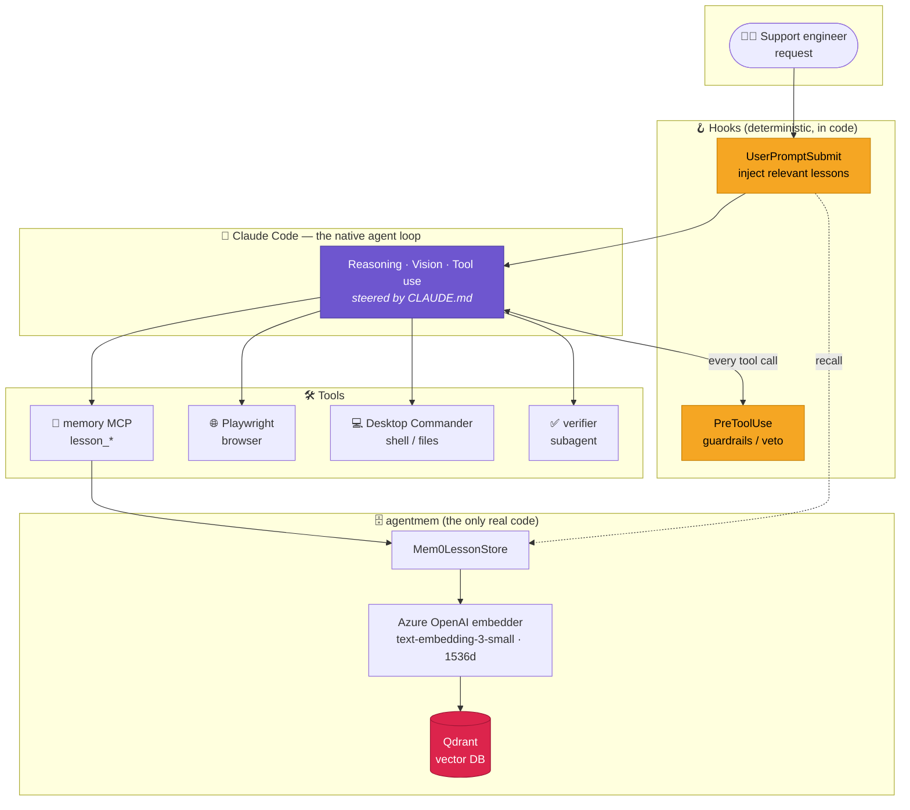
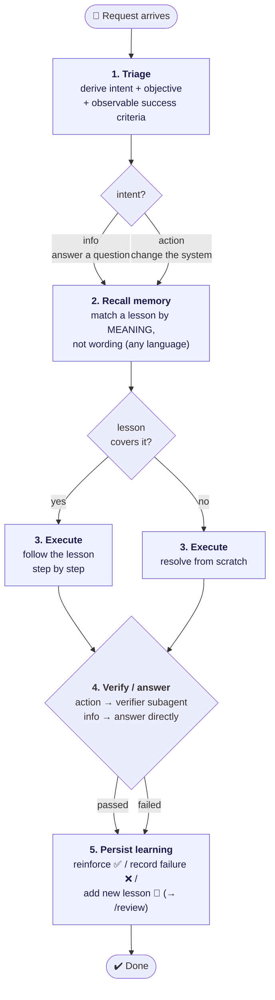
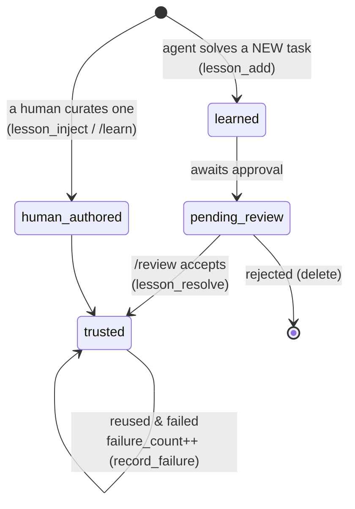
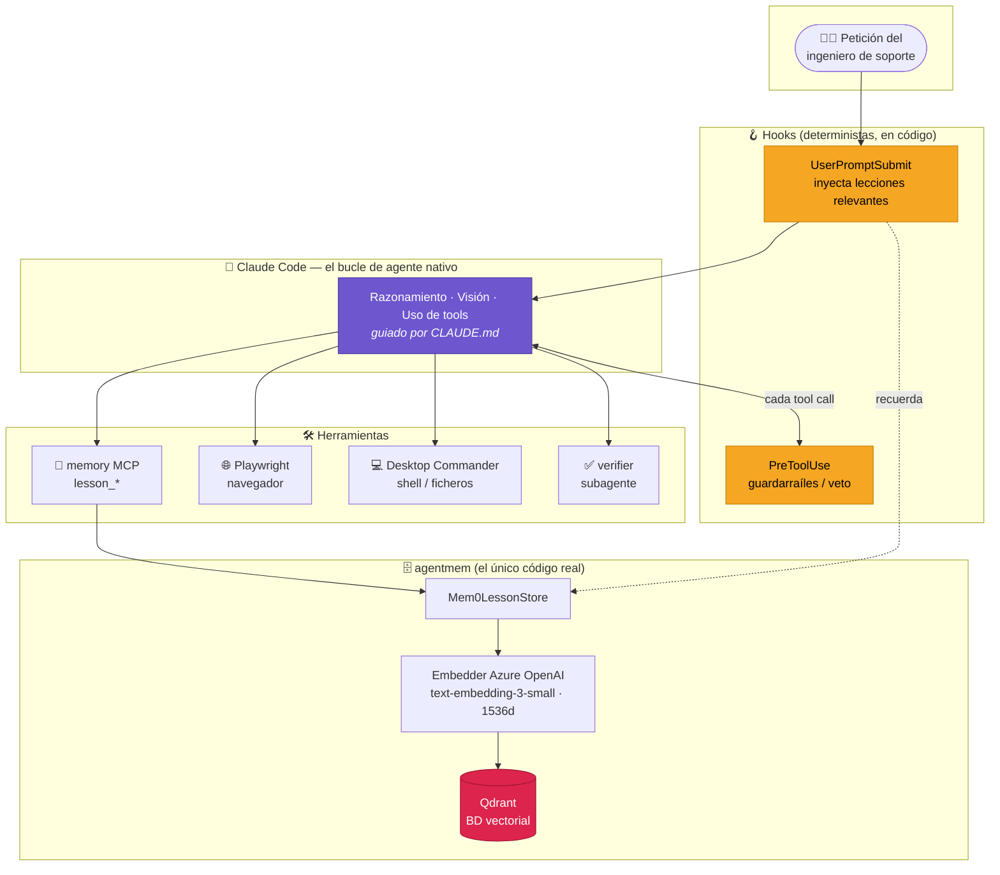
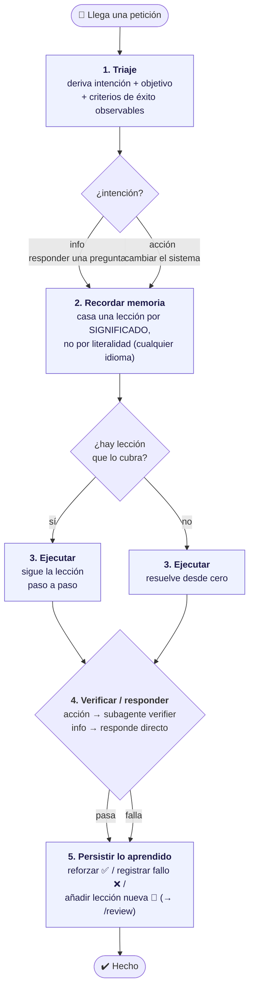
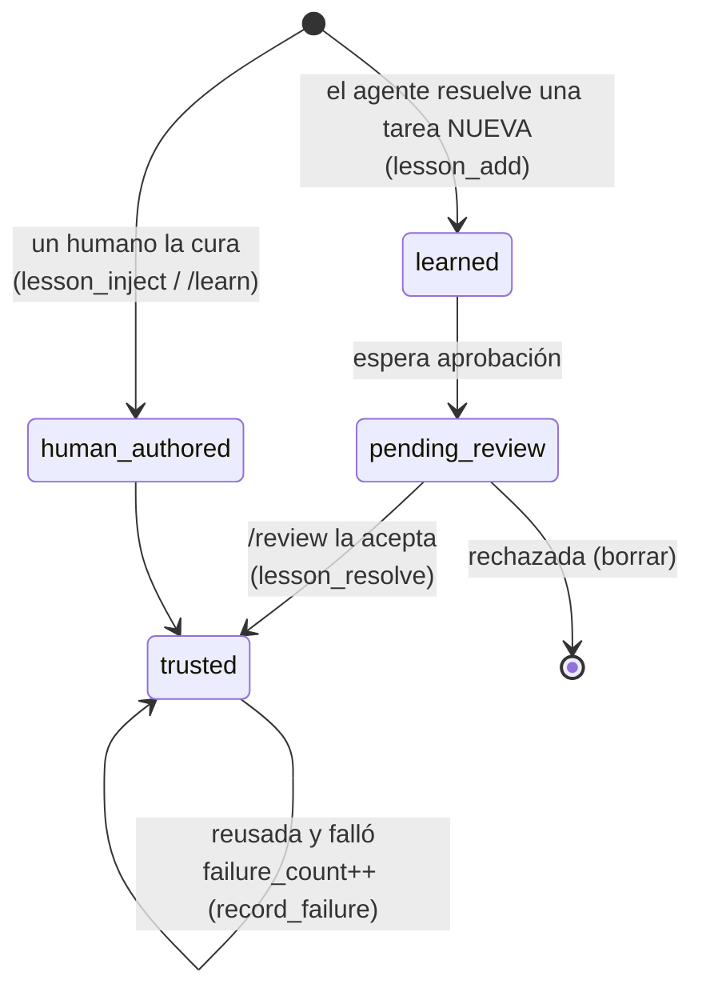
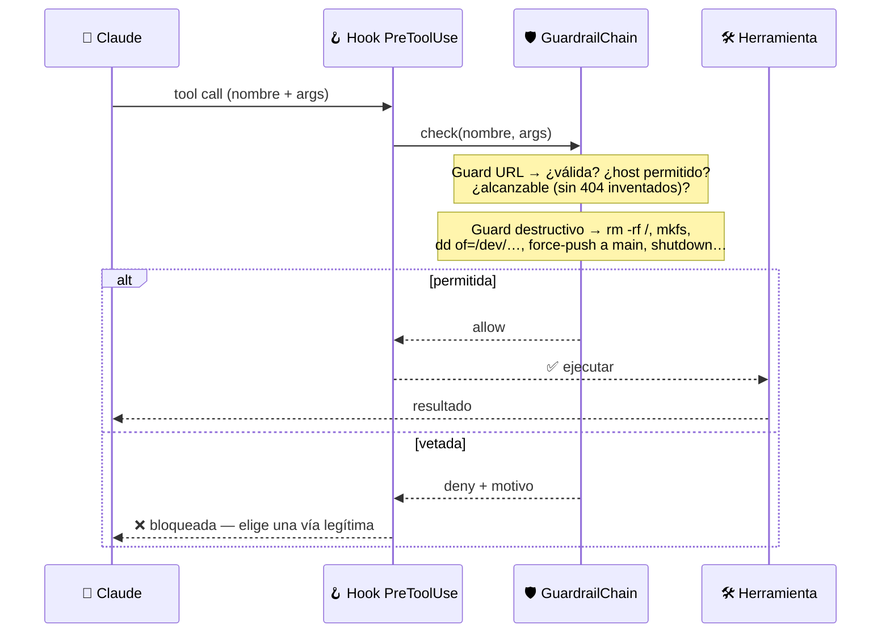

<div align="center">

# 🤖 Support Engineer

### A self-learning automation agent for enterprise support — built _on_ Claude Code, not just _with_ it.

**The loop, the reasoning and the vision are native. The only real code is a memory that lets the agent _learn_.**

[](https://claude.com/claude-code)
[](https://www.python.org/)
[](https://qdrant.tech/)
[](https://mem0.ai/)
[](https://modelcontextprotocol.io/)

[**English**](#-english) · [**Español**](#-español)

</div>

---

<a name="-english"></a>

## 🇬🇧 English

### What is this?

**Support Engineer is an automation agent for enterprise support tasks.** It runs on
**Claude Code**: the agent loop, the reasoning, and the vision (reading screenshots) are
all _native_ to the model — there is no orchestration framework to maintain.

The repository contributes **two things on top of Claude Code**:

| Piece | What it adds |
|-------|--------------|
| 🧠 **`agentmem`** — a lesson memory over Qdrant, exposed as the `memory` MCP server | The agent **remembers procedures** that worked and **reuses them by meaning**, so it learns from each solved task instead of starting from scratch. |
| 🪝 **Two hooks** — auto-inject lessons + apply guardrails | Relevant memory is **fed in automatically**, and dangerous actions are **vetoed in code** before they run. |

> Everything else — the operating flow — is **instructions**, not code. They live in
> [`CLAUDE.md`](./CLAUDE.md) and steer the model directly. The "scalator" idea: the agent
> _learns on its own_, turning each solved task into reusable memory.

### The big picture



### How a request flows

Every request follows a five-step flow defined in `CLAUDE.md`:



- **`intent = info`** → the engineer wants an _answer_; nothing changes. Reply with the concrete facts.
- **`intent = action`** → the engineer wants the system _changed_; execute, then **prove it** with the `verifier` subagent before claiming success.
- When unsure, treat it as **action** (the conservative execute-and-verify path).

### The memory: how lessons live and grow

A **lesson** is a reusable, step-by-step procedure (`title` + `content`) plus two
counters the agent folds back. Search is **purely semantic** (dense-vector cosine
similarity in Qdrant) — a Spanish lesson matches an English task and vice-versa.



> 🔒 **Trust model:** lessons the agent invents start as `learned / pending_review` and
> surface in **`/review`** for a human to accept — they never silently become trusted
> guidance. Human-authored lessons are trusted immediately.

### Guardrails — policy enforced in code, not in prompts

A `PreToolUse` hook runs **before every tool call** and can veto it. This is the
anti-hallucination and anti-destruction backstop.


Both guards **fail open**: a bug or missing dependency never wedges the agent.

### Project layout

```
support-engineer/
├── CLAUDE.md                 # the operating flow (instructions = behaviour)
├── config.yaml               # all settings (nested YAML) — single source of config
├── .env.example              # template for the gitignored .env (API keys + DC_MCP_HOME)
├── docker-compose.yml        # Qdrant on localhost:6333
├── .mcp.json                 # wires 3 MCP servers: memory (local), pw, dc (${DC_MCP_HOME})
├── start_dashboard.sh        # launch the control panel + open the browser
├── hooks/
│   ├── inject_lessons.py     # UserPromptSubmit → auto-recall lessons
│   └── guardrail_check.py    # PreToolUse → veto bad URLs / destructive cmds
├── dashboard/                # the control panel (stdlib HTTP server + web UI)
│   ├── server.py             # thin HTTP coordinator: routing + dispatch
│   ├── configfile.py         # config.yaml read/write (atomic, comment-preserving)
│   ├── settings_store.py     # settings.json permissions allowlist (atomic)
│   ├── translation.py        # glob ↔ blocklist-regex helpers (pure)
│   └── assets/               # layered front-end (api, dom, views, app)
└── src/agentmem/             # ← the only real code
    ├── config.py             # config layer (config.yaml → env vars → defaults)
    ├── lesson.py             # Lesson entity + origin / counters
    ├── ports.py              # LessonStore Protocol (the store abstraction)
    ├── store.py              # Mem0LessonStore over Qdrant (semantic)
    ├── atomicio.py           # atomic text-file writes (temp file + rename)
    ├── guardrails.py         # URL + destructive-command guards
    ├── rules_store.py        # custom (user-defined) blocked-command rules
    └── mcp_server.py         # exposes lesson_* as MCP tools
```

### Quick start

```bash
python -m venv .venv && source .venv/bin/activate   # 1. isolated env (Windows: .venv\Scripts\activate)
pip install -r requirements.txt                     # 2. pinned deps (share this + the repo with your team)
pip install -e .                                    # 3. install the agentmem package (editable)
docker compose up -d                                # 4. start Qdrant on :6333 (for rag.backend: qdrant)
# 5. open the repo in Claude Code — the `memory` MCP server + hooks load automatically
```

By default the embedder is **Azure OpenAI** (`text-embedding-3-small`, 1536d, **keyless**),
so lessons share the same vector space as the docs in Azure AI Search — set the SAME model
in the docs portal wizard. Two config switches (`config.yaml`) pick the rest: `llm.backend`
(`claude` | `local`) and `rag.backend` (`ai_search` | `qdrant`). For a fully offline stack,
set `embedder.provider: huggingface` (MiniLM, 384d) + `rag.backend: qdrant`.

### MCP servers

Claude Code wires the agent's tools from [`.mcp.json`](./.mcp.json) — **three** servers:

| Server | Tools | Origin |
|--------|-------|--------|
| `memory` | `lesson_*` | **This repo** — `python -m agentmem.mcp_server`. |
| `pw` | Playwright browser | npm on demand — `npx @playwright/mcp@latest`. |
| `dc` | Desktop Commander (shell / files) | A **local sibling checkout** at `${DC_MCP_HOME}`. |

`dc` is **not** vendored here — it runs from a separate Desktop Commander checkout on your
machine. For security and portability its path is **not hardcoded** in the committed
`.mcp.json`; instead it expands the `${DC_MCP_HOME}` environment variable:

```json
"dc": {
  "command": "node",
  "args": ["${DC_MCP_HOME}/dist/index.js"],
  "cwd": "${DC_MCP_HOME}"
}
```

Set `DC_MCP_HOME` to your clone (an **absolute** path — `.mcp.json` does not tilde-expand).
Keep the value in the gitignored `.env` (see `.env.example`), but note Claude Code expands
`.mcp.json` from the **process environment**, so export it before launching:

```bash
set -a; source .env; set +a     # load DC_MCP_HOME (and the API keys) into the env
claude                          # then launch Claude Code
```

If `DC_MCP_HOME` is unset the `dc` server simply fails to start; `memory` and `pw` are
unaffected. (You don't have Desktop Commander? Drop the `dc` block from `.mcp.json`.)

### Configuration

All settings live in [`config.yaml`](./config.yaml) (nested by section). Resolution order:

> **real environment variable** ⟶ **`config.yaml`** ⟶ **built-in defaults**

Each `section.key` maps to a flat env name via `config._FIELD_MAP` (e.g.
`embedder.provider` ⟶ `EMBEDDER_PROVIDER`), so any setting can be overridden per-deploy
with that env var. Point at another file with `AGENTMEM_CONFIG=/path/to/file`.

**Secrets live in `.env`, not in `config.yaml`.** API keys sit in a gitignored
[`.env`](./.env.example) (KEY=VALUE): `ANTHROPIC_API_KEY` for `llm.backend: claude`, or
`LLM_API_KEY` for `llm.backend: local` (LM Studio). The Azure AI Search backend
(`rag.backend: ai_search`) is **keyless** — Entra ID via `az login` / managed identity, no
key. Copy `.env.example` ⟶ `.env` and fill in what your switches need (relocate with
`AGENTMEM_DOTENV=/path/to/.env`).

#### Full `config.yaml` reference

| `section.key` | Env name | Default | Meaning |
|---------------|----------|---------|---------|
| `memory.qdrant_host` | `QDRANT_HOST` | `localhost` | Qdrant host. |
| `memory.qdrant_port` | `QDRANT_PORT` | `6333` | Qdrant port. |
| `memory.collection` | `MEM_COLLECTION` | `agentcore_lessons` | Qdrant collection holding the lessons. |
| `memory.mem_user` | `MEM_USER` | `agentcore` | mem0 identity namespace shared by all lessons. |
| `embedder.provider` | `EMBEDDER_PROVIDER` | `azure_openai` | Cloud default (keyless). Or `huggingface`/`fastembed` (local, offline), `openai`/`lmstudio`/`ollama`. |
| `embedder.model` | `EMBEDDER_MODEL` | `text-embedding-3-small` | azure_openai: the DEPLOYMENT name. Must match the docs vectorizer. |
| `embedder.base_url` | `EMBEDDER_BASE_URL` | `""` | azure_openai: the resource endpoint (`https://<res>.openai.azure.com`); openai/lmstudio: base url. |
| `embedder.api_key` | `EMBEDDER_API_KEY` | `${EMBEDDER_API_KEY}` → `.env` | Empty = keyless for azure_openai (Entra ID). Key for OpenAI-compatible providers. |
| `embedder.api_version` | `EMBEDDER_API_VERSION` | `2024-10-21` | azure_openai API version. |
| `embedder.dims` | `EMBEDDER_DIMS` | `1536` | Vector dimension — **must** match the model (1536 = text-embedding-3-small, 3072 = -large, 384 = MiniLM). |
| `embedder.check_reachable` | `EMBEDDER_CHECK_REACHABLE` | `false` | Preflight a remote OpenAI-compatible embedder (ollama/openai/lmstudio). No-op for azure_openai (keyless) and local providers. |
| `llm.backend` | `LLM_BACKEND` | `claude` | Who does the always-on lesson infer/rewrite: `claude` (Anthropic API) or `local` (OpenAI-compatible, e.g. qwen/LM Studio). infer is always on — not configurable. |
| `llm.claude_model` | `LLM_CLAUDE_MODEL` | `claude-sonnet-5` | Claude model for `backend: claude` (key from `ANTHROPIC_API_KEY`). |
| `llm.local_model` | `LLM_LOCAL_MODEL` | `qwen2.5-7b-instruct-1m` | Model for `backend: local`. |
| `llm.local_base_url` | `LLM_LOCAL_BASE_URL` | `http://localhost:1234/v1` | Endpoint for `backend: local` (key from `LLM_API_KEY`). |
| `llm.temperature` | `LLM_TEMPERATURE` | `0.1` | Sampling temperature for the infer/rewrite; never affects search. |
| `llm.top_p` | `LLM_TOP_P` | `1.0` | Nucleus sampling (dropped for `claude`, which rejects it with temperature). |
| `llm.max_tokens` | `LLM_MAX_TOKENS` | `2000` | Max tokens for the write-time rewrite. |
| `guardrails.url_enabled` | `GUARD_URL_ENABLED` | `true` | Master switch for the URL guard. |
| `guardrails.destructive_enabled` | `GUARD_DESTRUCTIVE_ENABLED` | `true` | Master switch for the destructive-command guard. |
| `guardrails.allow_domains` | `GUARD_ALLOW_DOMAINS` | `""` | Comma-separated host allowlist for browsing; empty = any host. |
| `guardrails.check_reachable` | `GUARD_CHECK_REACHABLE` | `true` | Probe that a URL is reachable before allowing navigation. |
| `guardrails.disabled_patterns` | `GUARD_DISABLED_PATTERNS` | `""` | Comma-separated keys of built-in destructive patterns to disable. |
| `guardrails.custom_rules_file` | `GUARD_CUSTOM_RULES_FILE` | `""` | JSON file of user rules; empty = `<repo>/custom_guardrails.json`. |
| `guardrails.probe_timeout` | `PROBE_TIMEOUT` | `5.0` | URL-reachability probe timeout (seconds). |
| `guardrails.probe_user_agent` | `PROBE_USER_AGENT` | `Mozilla/5.0 (agentmem url-guardrail)` | User-Agent for the probe. |
| `retrieval.search_limit` | `LESSON_SEARCH_LIMIT` | `8` | Default `top_k` for semantic recall. |
| `retrieval.list_limit` | `LESSON_LIST_LIMIT` | `1000` | `top_k` cap when enumerating all lessons. |
| `rag.backend` | `RAG_BACKEND` | `ai_search` | Where lessons + docs live: `ai_search` (Azure AI Search, default) or `qdrant` (local, offline). |
| `rag.top_k` | `RAG_TOP_K` | `5` | Default chunks `rag_search` returns. |
| `rag.qdrant_collection` | `RAG_QDRANT_COLLECTION` | `support_docs` | qdrant backend: documents collection (separate from lessons). |
| `azure_search.service` | `AZURE_SEARCH_SERVICE` | `""` | Azure AI Search **service name** (→ `https://<service>.search.windows.net`); keyless RBAC. Empty = inert. |
| `azure_search.lessons_index` | `AZURE_SEARCH_LESSONS_INDEX` | `agentmem-lessons` | Lessons index — written directly by mem0. |
| `azure_search.docs_index` | `AZURE_SEARCH_DOCS_INDEX` | `support-docs` | Documents index — loaded by a human via the portal from a blob. |
| `azure_search.vector_field` | `AZURE_SEARCH_VECTOR_FIELD` | `text_vector` | Docs vector column (the portal wizard's default). |
| `lessons.md_dir` | `LESSONS_MD_DIR` | `lessons` | Project directory to mirror each lesson as `<id>.md` (frontmatter + procedure). Empty = off. |

#### RAG / storage backend

Two independent switches decide where things run:

- **`llm.backend`** — who performs the always-on lesson infer/rewrite (the chat/agent is
  *always* Claude Code; this is only the internal rewrite step): `claude` (Anthropic API,
  same Claude family, key from `ANTHROPIC_API_KEY`) or `local` (an OpenAI-compatible LLM
  like qwen via LM Studio).
- **`rag.backend`** — where lessons *and* the document knowledge (`rag_search`) live:
  - **`qdrant`** (default): local Qdrant, fully offline. Lessons in the mem0 collection;
    documents in `rag.qdrant_collection`, loaded with `mcp__memory__rag_ingest(text,
    source)`.
  - **`ai_search`** (default): Azure AI Search (**keyless**, Entra ID — `az login`). Lessons
    are embedded locally (see `embedder.*`) and upserted **directly** (already vectorized) to
    `lessons_index` by mem0 — no blob, no indexer, instant. Documents are loaded by a human
    via the Azure Portal ("Import and vectorize data", integrated vectorization) into
    `docs_index`, and read via `rag_search`.

### Control panel

A visual control panel for a level-3 engineer to inspect and change everything the agent
exposes — no terminal needed. It is a **stdlib HTTP server** (config IO via ruamel.yaml) +
a layered web UI (Tailwind); the embedder/Qdrant aside, it runs fully offline.

```bash
./start_dashboard.sh            # starts the server and opens http://localhost:8787
./start_dashboard.sh 9000       # custom port
# or, manually:
python dashboard/server.py --port 8787
```

> Qdrant must be up (`docker compose up -d`) for the **Lessons** tab; the rest works without it.

| Tab | What you control |
|-----|------------------|
| **Guardrails** | URL guard on/off, reachability probe, domain allowlist, probe timeout/UA; destructive-guard master switch; how each guard works. |
| **Commands** | The full blocklist (built-in + **custom rules you add**, each toggled on/off or deleted) and the allowlist — **move commands either way** (allowed ⇆ blocked). |
| **Lessons** | Live counts (total / pending / approved) and the pending-review queue with **Validate** / **Reject**. |
| **Memory** | Qdrant host/port/collection/namespace, embedder provider/model/dims, retrieval limits. |

Edits are written back to [`config.yaml`](./config.yaml), `.claude/settings.json`
(permissions only) and `custom_guardrails.json` (user rules) — and apply on the agent's
next tool call. The dashboard edits the YAML in place (comments preserved) under
`guardrails.*` / `memory.*` / `embedder.*` / `retrieval.*`.

### Slash commands

| Command | Does |
|---------|------|
| `/review` | Triage the lessons the agent learned that await human approval. |
| `/learn <procedure>` | Manually capture a procedure into memory. |

---

<a name="-español"></a>

## 🇪🇸 Español

### ¿Qué es esto?

**Support Engineer es un agente de automatización para tareas de soporte
empresarial.** Funciona sobre **Claude Code**: el bucle del agente, el razonamiento y la
visión (leer capturas) son _nativos_ del modelo — no hay framework de orquestación que
mantener.

El repositorio aporta **dos cosas encima de Claude Code**:

| Pieza | Qué añade |
|-------|-----------|
| 🧠 **`agentmem`** — una memoria de lecciones sobre Qdrant, expuesta como el servidor MCP `memory` | El agente **recuerda procedimientos** que funcionaron y los **reutiliza por significado**, así que aprende de cada tarea en lugar de empezar de cero. |
| 🪝 **Dos hooks** — auto-inyectar lecciones + aplicar guardarraíles | La memoria relevante se **inyecta automáticamente**, y las acciones peligrosas se **vetan en código** antes de ejecutarse. |

> Todo lo demás — el flujo operativo — son **instrucciones**, no código. Viven en
> [`CLAUDE.md`](./CLAUDE.md) y guían al modelo directamente. La idea "scalator": el agente
> _aprende solo_, convirtiendo cada tarea resuelta en memoria reutilizable.

### La visión de conjunto



### Cómo fluye una petición

Cada petición sigue un flujo de cinco pasos definido en `CLAUDE.md`:



- **`intención = info`** → el ingeniero quiere una _respuesta_; nada cambia. Responde con los datos concretos.
- **`intención = acción`** → quiere _cambiar_ el sistema; ejecuta y luego **demuéstralo** con el subagente `verifier` antes de declarar éxito.
- En caso de duda, trátalo como **acción** (la vía conservadora: ejecutar y verificar).

### La memoria: cómo viven y crecen las lecciones

Una **lección** es un procedimiento reutilizable, paso a paso (`title` + `content`), más
dos contadores que el agente realimenta. La búsqueda es **puramente semántica**
(similitud de coseno sobre vectores densos en Qdrant) — una lección en español casa con
una tarea en inglés y viceversa.



> 🔒 **Modelo de confianza:** las lecciones que el agente inventa empiezan como
> `learned / pending_review` y aparecen en **`/review`** para que un humano las acepte —
> nunca se convierten en guía de confianza en silencio. Las creadas por humanos son de
> confianza al instante.

### Guardarraíles — política aplicada en código, no en prompts

Un hook `PreToolUse` se ejecuta **antes de cada llamada a herramienta** y puede vetarla.
Es la red de seguridad anti-alucinación y anti-destrucción.



Ambos guards **fallan en abierto** (_fail-open_): un bug o una dependencia ausente nunca
bloquean al agente.

### Estructura del proyecto

```
support-engineer/
├── CLAUDE.md                 # el flujo operativo (instrucciones = comportamiento)
├── config.yaml               # todos los ajustes (YAML por secciones) — fuente única de config
├── .env.example              # plantilla del .env gitignored (API keys + DC_MCP_HOME)
├── docker-compose.yml        # Qdrant en localhost:6333
├── .mcp.json                 # cablea 3 servidores MCP: memory (local), pw, dc (${DC_MCP_HOME})
├── start_dashboard.sh        # arranca el panel de control + abre el navegador
├── hooks/
│   ├── inject_lessons.py     # UserPromptSubmit → auto-recuerda lecciones
│   └── guardrail_check.py    # PreToolUse → veta URLs malas / comandos destructivos
├── dashboard/                # el panel de control (servidor HTTP stdlib + UI web)
│   ├── server.py             # coordinador HTTP fino: enrutado + dispatch
│   ├── configfile.py         # lectura/escritura de config.yaml (atómica, conserva comentarios)
│   ├── settings_store.py     # allowlist de permisos en settings.json (atómica)
│   ├── translation.py        # helpers glob ↔ regex de bloqueo (puros)
│   └── assets/               # front-end por capas (api, dom, views, app)
└── src/agentmem/             # ← el único código real
    ├── config.py             # capa de config (config.yaml → env vars → defaults)
    ├── lesson.py             # entidad Lesson + origen / contadores
    ├── ports.py              # Protocol LessonStore (la abstracción del almacén)
    ├── store.py              # Mem0LessonStore sobre Qdrant (semántico)
    ├── atomicio.py           # escrituras atómicas de ficheros (temp + rename)
    ├── guardrails.py         # guards de URL + comandos destructivos
    ├── rules_store.py        # reglas de comandos bloqueados definidas por el usuario
    └── mcp_server.py         # expone lesson_* como tools MCP
```

### Arranque rápido

```bash
python -m venv .venv && source .venv/bin/activate   # 1. entorno aislado (Windows: .venv\Scripts\activate)
pip install -r requirements.txt                     # 2. deps pinneadas (comparte esto + el repo con tu equipo)
pip install -e .                                    # 3. instala el paquete agentmem (editable)
docker compose up -d                                # 4. arranca Qdrant en :6333 (para rag.backend: qdrant)
# 5. abre el repo en Claude Code — el servidor MCP `memory` + los hooks cargan solos
```

Por defecto el embedder es **Azure OpenAI** (`text-embedding-3-small`, 1536d, **sin clave**),
para que las lecciones compartan el mismo espacio vectorial que los docs en Azure AI Search
— pon el MISMO modelo en el wizard de docs del portal. Dos switches en `config.yaml` eligen
el resto: `llm.backend` (`claude` | `local`) y `rag.backend` (`ai_search` | `qdrant`). Para
un stack totalmente offline: `embedder.provider: huggingface` (MiniLM, 384d) + `rag.backend:
qdrant`.

### Servidores MCP

Claude Code cablea las tools del agente desde [`.mcp.json`](./.mcp.json) — **tres** servidores:

| Servidor | Tools | Origen |
|----------|-------|--------|
| `memory` | `lesson_*` | **Este repo** — `python -m agentmem.mcp_server`. |
| `pw` | Navegador Playwright | npm bajo demanda — `npx @playwright/mcp@latest`. |
| `dc` | Desktop Commander (shell / ficheros) | Un **checkout hermano local** en `${DC_MCP_HOME}`. |

`dc` **no** está incluido en este repo — corre desde un checkout aparte de Desktop
Commander en tu máquina. Por seguridad y portabilidad su ruta **no está hardcodeada** en el
`.mcp.json` versionado; en su lugar expande la variable de entorno `${DC_MCP_HOME}`:

```json
"dc": {
  "command": "node",
  "args": ["${DC_MCP_HOME}/dist/index.js"],
  "cwd": "${DC_MCP_HOME}"
}
```

Pon `DC_MCP_HOME` apuntando a tu clon (ruta **absoluta** — `.mcp.json` no expande `~`).
Guarda el valor en el `.env` gitignored (ver `.env.example`), pero ten en cuenta que Claude
Code expande `.mcp.json` desde el **entorno del proceso**, así que expórtalo antes de
arrancar:

```bash
set -a; source .env; set +a     # carga DC_MCP_HOME (y las API keys) en el entorno
claude                          # luego arranca Claude Code
```

Si `DC_MCP_HOME` no está definida, el servidor `dc` simplemente no arranca; `memory` y `pw`
no se ven afectados. (¿No tienes Desktop Commander? Quita el bloque `dc` de `.mcp.json`.)

### Configuración

Todos los ajustes viven en [`config.yaml`](./config.yaml) (YAML por secciones). Orden de
resolución:

> **variable de entorno real** ⟶ **`config.yaml`** ⟶ **defaults del código**

Cada `section.key` mapea a un nombre de env plano vía `config._FIELD_MAP` (p. ej.
`embedder.provider` ⟶ `EMBEDDER_PROVIDER`), así cualquier ajuste se puede sobrescribir por
despliegue con esa env var. Apunta a otro fichero con `AGENTMEM_CONFIG=/ruta/al/fichero`.

**Los secretos viven en `.env`, no en `config.yaml`.** Las API keys están en un `.env`
gitignored (KEY=VALUE): `ANTHROPIC_API_KEY` para `llm.backend: claude`, o `LLM_API_KEY`
para `llm.backend: local` (LM Studio). El backend Azure AI Search (`rag.backend:
ai_search`) es **sin clave** — Entra ID vía `az login` / managed identity. Copia
`.env.example` ⟶ `.env` y pon lo que tus switches necesiten (reubica con
`AGENTMEM_DOTENV=/ruta/al/.env`).

#### Referencia completa de `config.yaml`

| `section.key` | Nombre env | Default | Significado |
|---------------|------------|---------|-------------|
| `memory.qdrant_host` | `QDRANT_HOST` | `localhost` | Host de Qdrant. |
| `memory.qdrant_port` | `QDRANT_PORT` | `6333` | Puerto de Qdrant. |
| `memory.collection` | `MEM_COLLECTION` | `agentcore_lessons` | Colección de Qdrant con las lecciones. |
| `memory.mem_user` | `MEM_USER` | `agentcore` | Namespace de identidad de mem0 (compartido por todas). |
| `embedder.provider` | `EMBEDDER_PROVIDER` | `azure_openai` | Default cloud (sin clave). O `huggingface`/`fastembed` (local, offline), `openai`/`lmstudio`/`ollama`. |
| `embedder.model` | `EMBEDDER_MODEL` | `text-embedding-3-small` | azure_openai: nombre del DEPLOYMENT. Debe coincidir con el vectorizador de docs. |
| `embedder.base_url` | `EMBEDDER_BASE_URL` | `""` | azure_openai: endpoint del recurso (`https://<res>.openai.azure.com`); openai/lmstudio: base url. |
| `embedder.api_key` | `EMBEDDER_API_KEY` | `${EMBEDDER_API_KEY}` → `.env` | Vacío = sin clave para azure_openai (Entra ID). Key para providers OpenAI-compatibles. |
| `embedder.api_version` | `EMBEDDER_API_VERSION` | `2024-10-21` | Versión de API de azure_openai. |
| `embedder.dims` | `EMBEDDER_DIMS` | `1536` | Dimensión del vector — **debe** coincidir con el modelo (1536 = text-embedding-3-small, 3072 = -large, 384 = MiniLM). |
| `embedder.check_reachable` | `EMBEDDER_CHECK_REACHABLE` | `false` | Preflight de un embedder remoto OpenAI-compatible (ollama/openai/lmstudio). No-op para azure_openai (sin clave) y providers locales. |
| `llm.backend` | `LLM_BACKEND` | `claude` | Quién hace la infer/reescritura (siempre activa, no configurable): `claude` (API de Anthropic) o `local` (OpenAI-compatible, p. ej. qwen/LM Studio). |
| `llm.claude_model` | `LLM_CLAUDE_MODEL` | `claude-sonnet-5` | Modelo Claude para `backend: claude` (key de `ANTHROPIC_API_KEY`). |
| `llm.local_model` | `LLM_LOCAL_MODEL` | `qwen2.5-7b-instruct-1m` | Modelo para `backend: local`. |
| `llm.local_base_url` | `LLM_LOCAL_BASE_URL` | `http://localhost:1234/v1` | Endpoint para `backend: local` (key de `LLM_API_KEY`). |
| `llm.temperature` | `LLM_TEMPERATURE` | `0.1` | Temperatura de la infer/reescritura; nunca afecta la búsqueda. |
| `llm.top_p` | `LLM_TOP_P` | `1.0` | Nucleus sampling (se descarta en `claude`, que lo rechaza junto a temperature). |
| `llm.max_tokens` | `LLM_MAX_TOKENS` | `2000` | Máx. tokens de la reescritura al guardar. |
| `guardrails.url_enabled` | `GUARD_URL_ENABLED` | `true` | Interruptor maestro del guard de URL. |
| `guardrails.destructive_enabled` | `GUARD_DESTRUCTIVE_ENABLED` | `true` | Interruptor maestro del guard de comandos destructivos. |
| `guardrails.allow_domains` | `GUARD_ALLOW_DOMAINS` | `""` | Allowlist de hosts (coma-separada) para navegar; vacío = cualquiera. |
| `guardrails.check_reachable` | `GUARD_CHECK_REACHABLE` | `true` | Comprueba que la URL es accesible antes de permitir navegar. |
| `guardrails.disabled_patterns` | `GUARD_DISABLED_PATTERNS` | `""` | Keys (coma-separadas) de patrones destructivos built-in a desactivar. |
| `guardrails.custom_rules_file` | `GUARD_CUSTOM_RULES_FILE` | `""` | Fichero JSON de reglas de usuario; vacío = `<repo>/custom_guardrails.json`. |
| `guardrails.probe_timeout` | `PROBE_TIMEOUT` | `5.0` | Timeout (s) del probe de accesibilidad de URL. |
| `guardrails.probe_user_agent` | `PROBE_USER_AGENT` | `Mozilla/5.0 (agentmem url-guardrail)` | User-Agent del probe. |
| `retrieval.search_limit` | `LESSON_SEARCH_LIMIT` | `8` | `top_k` por defecto en la recuperación semántica. |
| `retrieval.list_limit` | `LESSON_LIST_LIMIT` | `1000` | Tope de `top_k` al enumerar todas las lecciones. |
| `rag.backend` | `RAG_BACKEND` | `ai_search` | Dónde viven lecciones + docs: `ai_search` (Azure AI Search, default) o `qdrant` (local, offline). |
| `rag.top_k` | `RAG_TOP_K` | `5` | Nº de chunks que devuelve `rag_search` por defecto. |
| `rag.qdrant_collection` | `RAG_QDRANT_COLLECTION` | `support_docs` | Backend qdrant: colección de documentos (aparte de las lecciones). |
| `azure_search.service` | `AZURE_SEARCH_SERVICE` | `""` | **Nombre del servicio** Azure AI Search (→ `https://<service>.search.windows.net`); RBAC sin clave. Vacío = inerte. |
| `azure_search.lessons_index` | `AZURE_SEARCH_LESSONS_INDEX` | `agentmem-lessons` | Índice de lecciones — escrito directamente por mem0. |
| `azure_search.docs_index` | `AZURE_SEARCH_DOCS_INDEX` | `support-docs` | Índice de documentos — cargado por un humano vía el portal desde un blob. |
| `azure_search.vector_field` | `AZURE_SEARCH_VECTOR_FIELD` | `text_vector` | Columna vectorial de docs (default del asistente del portal). |
| `lessons.md_dir` | `LESSONS_MD_DIR` | `lessons` | Directorio del proyecto donde espejar cada lección como `<id>.md` (frontmatter + procedimiento). Vacío = off. |

#### RAG / backend de almacenamiento

Dos switches independientes deciden dónde corre todo:

- **`llm.backend`** — quién hace la infer/reescritura siempre activa (el chat/agente es
  *siempre* Claude Code; esto es solo el paso interno de reescritura): `claude` (API de
  Anthropic, misma familia Claude, key de `ANTHROPIC_API_KEY`) o `local` (un LLM
  OpenAI-compatible como qwen vía LM Studio).
- **`rag.backend`** — dónde viven las lecciones *y* el conocimiento documental (`rag_search`):
  - **`qdrant`** (default): Qdrant local, totalmente offline. Lecciones en la colección
    mem0; documentos en `rag.qdrant_collection`, cargados con `mcp__memory__rag_ingest(text,
    source)`.
  - **`ai_search`** (default): Azure AI Search (**sin clave**, Entra ID — `az login`). Las
    lecciones se embeben en local (ver `embedder.*`) y mem0 las sube **directamente** (ya
    vectorizadas) a `lessons_index` — sin blob, sin indexer, instantáneo. Los documentos los
    carga un humano vía el Azure Portal ("Import and vectorize data", vectorización integrada)
    en `docs_index`, y se leen vía `rag_search`.

### Panel de control

Un panel visual para que un ingeniero de nivel 3 inspeccione y cambie todo lo que el
agente expone — sin tocar la terminal. Es un **servidor HTTP de la stdlib** (IO de config
vía ruamel.yaml) + una UI web por capas (Tailwind); salvo el embedder/Qdrant, funciona 100%
offline.

```bash
./start_dashboard.sh            # arranca el servidor y abre http://localhost:8787
./start_dashboard.sh 9000       # puerto a medida
# o, manualmente:
python dashboard/server.py --port 8787
```

> Qdrant debe estar arriba (`docker compose up -d`) para la pestaña **Lecciones**; el resto funciona sin él.

| Pestaña | Qué controlas |
|---------|---------------|
| **Guardrails** | Guard de URL on/off, probe de accesibilidad, allowlist de dominios, timeout/UA; interruptor maestro del guard destructivo; cómo funciona cada guard. |
| **Comandos** | La blocklist completa (built-in + **reglas custom que añades**, cada una activable o eliminable) y la allowlist — **mueve comandos en ambos sentidos** (permitido ⇆ bloqueado). |
| **Lecciones** | Conteos en vivo (total / por revisar / aprobadas) y la cola pendiente con **Validar** / **Rechazar**. |
| **Memoria** | Host/puerto/colección/namespace de Qdrant, provider/modelo/dims del embedder, límites de recuperación. |

Los cambios se escriben en [`config.yaml`](./config.yaml), `.claude/settings.json` (solo
permisos) y `custom_guardrails.json` (reglas de usuario) — y aplican en la siguiente
llamada del agente. El panel edita el YAML in situ (conservando comentarios) bajo
`guardrails.*` / `memory.*` / `embedder.*` / `retrieval.*`.

### Comandos slash

| Comando | Hace |
|---------|------|
| `/review` | Tría las lecciones que el agente aprendió y esperan aprobación humana. |
| `/learn <procedimiento>` | Captura manualmente un procedimiento en memoria. |

---

<div align="center">

**Built on 🤖 [Claude Code](https://claude.com/claude-code) · Powered by 🧠 [mem0](https://mem0.ai/) + [Qdrant](https://qdrant.tech/)**

</div>
=======

