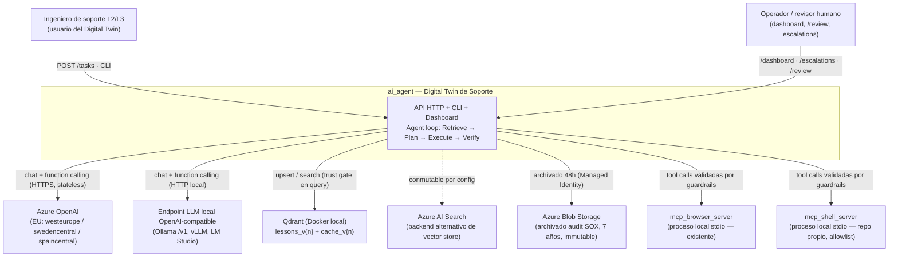
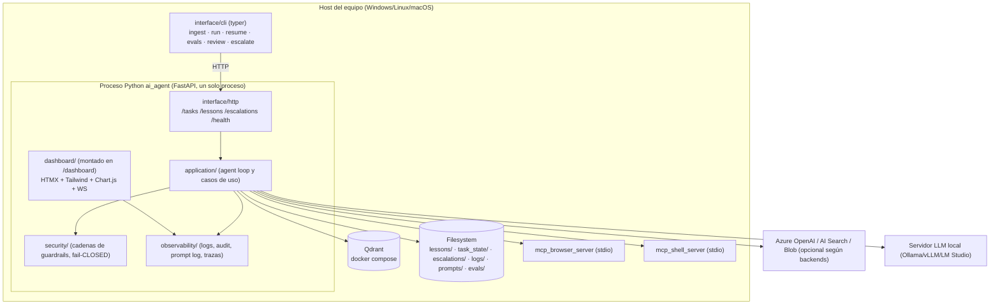
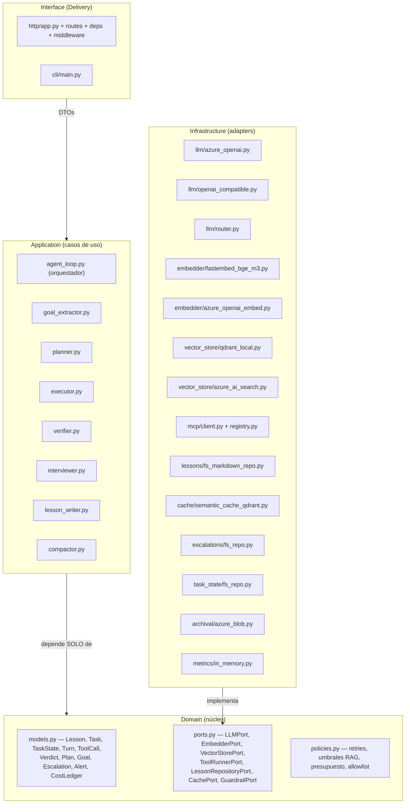

# 01 — Arquitectura (C4 + capas hexagonales)

Fuente: plan v1.3.1 §Arquitectura por capas, §Cómo hablamos con el LLM, F0.

## 1. C4 — Nivel 1: Contexto

Invariantes de contexto (plan §Cómo hablamos con el LLM):

1. El LLM es un endpoint HTTPS **stateless**: recibe texto + schema de tools y
   devuelve texto o `tool_calls`. No ejecuta nada, no tiene red ni credenciales.
2. Los MCP tools son **procesos locales** lanzados por el composition root vía
   stdio. El LLM *sugiere* tool_calls; el **Executor** decide si obedecer tras
   los guardrails, y ejecuta.
3. La capacidad del agente se compone de tools MCP explícitos con allowlist +
   lecciones; «instala X» es una lección, no una función del LLM.
4. Autenticación: Azure → Managed Identity en producción (API key solo `mode: dev`);
   local → sin auth o token estático que nunca sale de la máquina.

## 2. C4 — Nivel 2: Contenedores

Notas:

- **La CLI no tiene lógica**: es un cliente HTTP de la API (plan §Contexto).
- El dashboard es **la misma app FastAPI** montada en `/dashboard`; la primera
  iteración (F4.5: pestañas Escalations/Review) y la final (F5.5) son la misma
  aplicación (cambio v1.3.1 #6).
- Qdrant aloja dos colecciones versionadas: `lessons_v{n}` y `cache_v{n}`,
  ambas ligadas a un `embedder_id` (F6.2).

## 3. C4 — Nivel 3: Componentes (capas hexagonales)

Cross-cutting (decoradores y middleware, nunca pasos del loop): **Security**
(doc 05), **Observability** (doc 06), **Evaluation** (doc 07, offline),
**Config** (doc 08).

### Reglas de dependencia (SOLID, verificables por lint de imports)

| Regla | Enunciado | Verificación |
|---|---|---|
| DIP | `application/` importa solo `domain/` (ports y modelos); jamás `infrastructure/` ni SDKs | test de imports en CI |
| OCP | Un backend nuevo = un adapter nuevo; cero cambios en `application/` | test F1/F6: conmutar backend solo toca el composition root |
| LSP | Los 2 adapters de `LLMPort` y los 2 de `VectorStorePort` pasan **la misma suite de contrato** | contract tests (doc 03 §5) |
| SRP | Un módulo, un motivo de cambio: el Verifier no sabe de RAG; el Planner no sabe de HTTP | revisión + estructura de paquetes |
| ISP | 7 ports pequeños; prohibido un `IEverything` | doc 03 |
| Wiring | Solo `main.py` construye adapters; ningún módulo lee `os.environ` | test de F0 + grep en CI |

## 4. Composition root — secuencia de arranque (fail-closed)

`main.py` es la única fuente de wiring. Orden normativo; **cualquier paso que
falle aborta el arranque con mensaje accionable** (nunca se sirve tráfico en
estado degradado desconocido):

1. Cargar `.env` → parsear `config.yaml` → resolver `${VAR}` → `Settings`
   inmutable (Pydantic Settings).
2. **Validaciones cruzadas** (tabla completa en doc 08 §3): dims embedder ↔
   `vector_store.vector_size` ↔ metadata de la colección; `llm.backend=local` ⇒
   `base_url` presente; `cacheable_call_types ∩ never_cacheable = ∅`; endpoint
   Azure en `region_allowlist` si `llm.backend=azure_openai`.
3. Construir adapters según config: LLM (uno de dos) + Router, embedder,
   vector store, cache, repos FS, cliente MCP (arranca servidores stdio de
   `mcp_servers` y puebla el registry con prefijos).
4. **Health-checks bloqueantes**: canario de function calling si backend local;
   canario de content filter si backend azure; self-test del redactor
   (rule-sets `secrets` y `pii`); canary de cada guardrail; compatibilidad
   `embedder_id` ↔ metadata de colección.
5. **Recovery**: escanear `task_state/` buscando `status=running` huérfanos →
   marcarlos `awaiting_resume` (nunca reanudar solos, ADR-009).
6. Montar FastAPI (+ `/dashboard`), registrar middleware (auth, rate limit,
   audit) y exponer `/health` con el estado de cada check (los N/A del backend
   activo se reportan como tales, no se ocultan).

## 5. Vista de despliegue

| Elemento | Dónde corre | Estado |
|---|---|---|
| `ai_agent` (API+dashboard+loop) | proceso Python local, `runtime.host:port` (default `127.0.0.1:8080`) | stateless salvo FS local |
| Qdrant | Docker local (`docker compose up -d`) | persistente (volumen) |
| MCP servers (browser, shell) | procesos hijos stdio del composition root | efímeros |
| LLM | Azure OpenAI (región EU) **o** servidor local | externo |
| Archivado SOX | Azure Blob immutable 7 años | externo, fail-closed |
| Estado operativo | `lessons/` (fuente de verdad re-ingerible), `task_state/`, `escalations/`, `logs/`, `prompts/`, `evals/` | FS local, append-only donde aplica |

Sin Kubernetes, sin autoscaling, sin multi-tenant real en fase 1 (plan
§Decisiones — excluido). Session isolation = `session_id` en TaskState +
namespaces de budget y cache (F4.6.8).

## 6. Estructura de paquetes

La estructura normativa de ficheros es la del plan §Estructura de ficheros
propuesta (árbol `ai_agent/`) y no se duplica aquí. Regla del DSA: **ningún
módulo nuevo sin capa asignada**; si un fichero no encaja en
Domain/Application/Infrastructure/Interface ni en un cross-cutting declarado,
la propuesta debe revisarse antes de crearlo.
