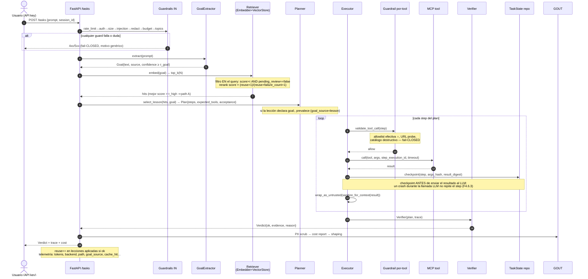
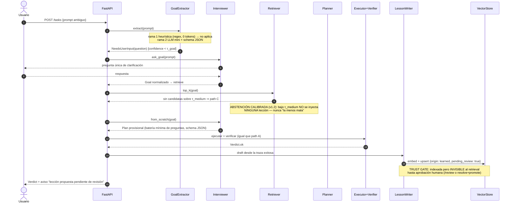
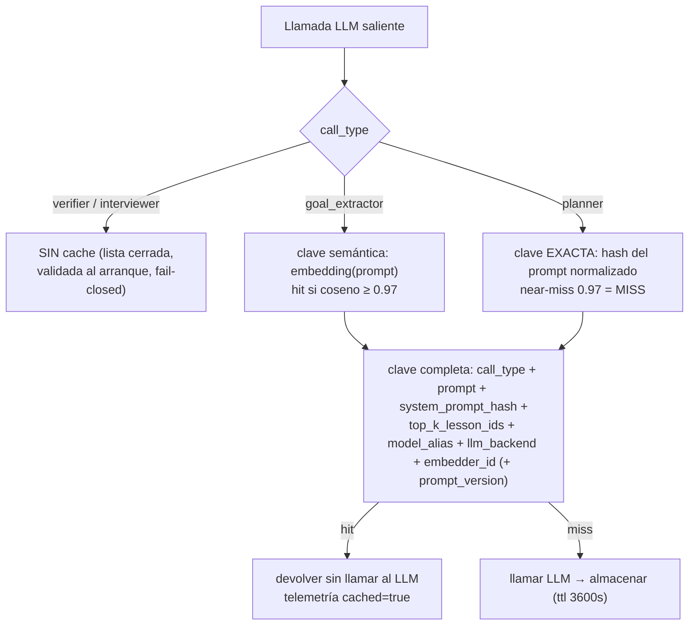
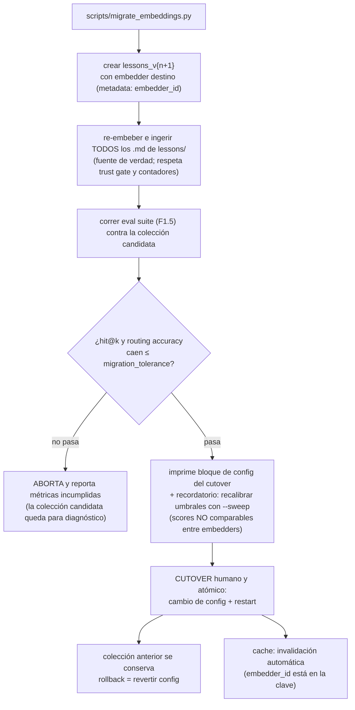

# 02 — Flujos (diagramas de secuencia)

Fuente: plan v1.3.1 §Agent Loop (flujo canónico), F2–F4.6, F5 (cache), F6.

Convenciones: `GIN`/`GOUT` = cadenas de guardrails de entrada/salida (doc 05);
todo participante emite telemetría correlacionada por `correlation_id` (doc 06);
las llamadas LLM pasan SIEMPRE antes por el rule-set `pii` del redactor.

## 1. Path A — lección con score alto (flujo canónico completo)



## 2. Goal ambiguo y path C — Interviewer + LessonWriter



Path B (candidatas de score medio) es idéntico salvo el primer salto:
`IV.disambiguate(hits)` en lugar de `from_scratch(goal)`.

## 3. Verificación fallida — reintentos y escalación humana

```mermaid
sequenceDiagram
    autonumber
    participant AL as AgentLoop
    participant P as Planner
    participant E as Executor
    participant V as Verifier
    participant HQ as EscalationQueue (fs_repo)
    participant D as Dashboard/notify

    AL->>E: ejecutar plan
    E->>V: verify(plan, trace)
    V-->>AL: Verdict{ok:false, reason}
    loop mientras retries < agent.max_retries
        AL->>P: re_plan(feedback=Verdict.reason)
        P-->>AL: plan corregido
        AL->>E: ejecutar → verificar
    end
    V-->>AL: Verdict{ok:false} con retries == max
    AL->>HQ: enqueue Escalation{task_id, goal, plan, trace, verdict, reason, status: open}
    Note over AL: failure_count++ en las lecciones aplicadas<br/>(señal de calidad; NUNCA borrado automático)
    HQ->>D: webhook/email (escalations.notify) + WS al dashboard
    Note over HQ: humano: claim → resolve (opcional promote_to_lesson=true<br/>⇒ draft pending_review=true en /review) | dismiss
```

Triggers automáticos de escalación (F4.5.3): `retries == max` con `!ok`;
`GoalExtractor.confidence < τ` en modo batch; guardrail bloquea sin alternativa.

## 4. Crash y resume humano (F4.6)

```mermaid
sequenceDiagram
    autonumber
    participant E as Executor
    participant T as task_state/fs_repo
    participant CR as Composition root (arranque)
    actor H as Humano
    participant API as FastAPI

    E->>T: checkpoint step 1 (línea JSONL, write-temp+rename+fsync)
    E->>T: checkpoint step 2
    Note over E: 💥 SIGKILL durante la llamada LLM post-step-2
    CR->>T: (arranque) escanear status=running huérfanos
    CR->>T: marcar awaiting_resume
    H->>API: GET /tasks?status=awaiting_resume
    H->>API: POST /tasks/{id}/resume
    Note over API: resume NUNCA automático (auto_resume:false):<br/>el mundo pudo cambiar; re-ejecutar efectos exige criterio
    API->>T: leer última línea VÁLIDA (tolera línea final truncada)
    API->>E: reconstruir contexto (plan + steps 1-2 como observaciones<br/>ya spotlighted) y continuar desde current_step_index=3
    Note over E: steps 1-2 NO se re-ejecutan; dedup best-effort<br/>por step_execution_id en MCP propios
```

## 5. Cache semántico — dos estrategias de matching (v1.3.1)



Racional (cambio v1.3.1 #2): un plan es un artefacto ejecutable; un near-miss
semántico puede pertenecer a otra tarea — el mismo fallo silencioso C→A que la
abstención calibrada blinda, reintroducido por otra puerta. En el
`goal_extractor` un near-miss es inocuo: el goal resultante pasa igualmente por
retrieval y umbrales. Todo el cache queda **diferido-con-datos**: la métrica
`cache_hit_ratio_by_call_type` decide si se mantiene tras el primer mes.

## 6. Migración de embedder (F6.2) — colecciones versionadas



Conmutar **vector store** (F6.1) sí es solo un adapter + re-ingesta con el
mismo embedder. Conmutar **LLM backend** (F6.3) es un flag + canario de tool
calling bloqueante; el contrato de serving del endpoint local (contexto ≥16k,
cuantización ≥Q5/AWQ, batching) vive en la capa de serving, fuera del codebase.

## 7. Degradación por presupuesto (F5.1) — máquina de estados del Router

```mermaid
stateDiagram-v2
    [*] --> Normal
    Normal: alias por política (default mini;<br/>escalate_on → full)
    Normal --> Aviso: usage ≥ warn_at_pct (80%)
    Aviso: igual que Normal + aviso al usuario
    Aviso --> Degradado: usage ≥ degrade_at_pct (85%)
    Degradado: full PROHIBIDO — todo a mini<br/>telemetría degraded=true
    Degradado --> Parado: usage ≥ 100% y hard_stop
    Parado: corte de servicio de la sesión
    note right of Degradado
        El Verifier sigue aplicando: si una tarea
        complex no pasa con mini → escala a humano,
        no gasta lo que no hay.
    end note
```


