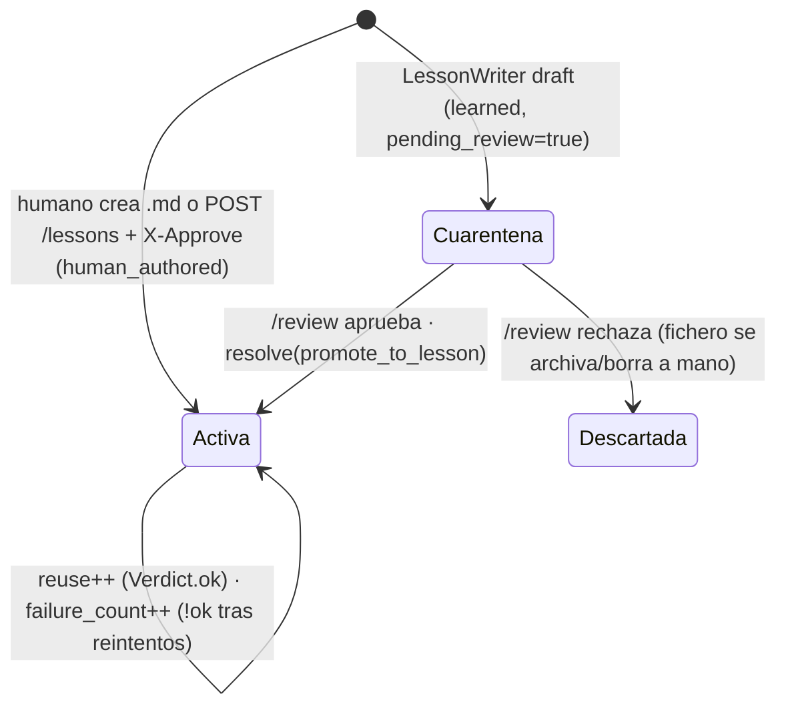

# 04 — Esquemas de datos

Fuente: plan v1.3.1 §Contrato de lección, F1.6, F1.5, F4.5, F4.6, F5.5.
Todos los ficheros de estado son **JSON line-delimited append-only** con
escritura atómica (write-temp + rename; `fsync` donde el config lo exige).
Toda entidad temporal usa timestamps ISO-8601 UTC.

## 1. Lección (`lessons/*.md` — frontmatter YAML + markdown)

El schema normativo es el del plan §Contrato de "lección"; se reproduce el
contrato de campos:

| Campo | Tipo | Regla |
|---|---|---|
| `id` | slug único | clave del vector store y del golden set |
| `title` | str | — |
| `version` | semver | `lesson_version` viaja en el payload de cada punto |
| `origin` | `human_authored \| learned` | inmutable tras creación |
| `pending_review` | bool | `learned` nace `true` (trust gate); `human_authored` nace `false` |
| `reuse` / `failure_count` | int ≥ 0 | solo señal de calidad; sin decay, sin borrado automático |
| `goal` | str? | si presente, prevalece sobre el inferido (`goal_source=lesson`) |
| `tags` | list[str] | — |
| `preconditions` | list[map] | evaluables por el Planner antes de ejecutar |
| `tools_allowed` | list[str] | **obligatoria** si `require_lesson_allowlist=true`; si falta → rechazo en ingest |
| `acceptance` | `{type: rule\|llm_judge\|hybrid, rules?, llm_judge_prompt?}` | consumida por el Verifier |
| `cost` | `{max_tokens, preferred_model}` | pista para el Router |
| cuerpo markdown | `## Pasos` numerados | insumo del Planner |

Ciclo de vida (estado derivado, no campo):



## 2. Payload de punto en `lessons_v{n}` (Qdrant / AI Search)

```json
{
  "lesson_id": "sn-ami-export-last-page",
  "chunk_id": "sn-ami-export-last-page#0",
  "lesson_version": "1.2.0",
  "embedder_id": "bge-m3-1024",
  "origin": "human_authored",
  "pending_review": false,
  "reuse": 5,
  "failure_count": 0,
  "tags": ["servicenow", "sox", "export"],
  "goal": "Obtener y capturar las filas visibles…",
  "text": "<contenido del chunk según lessons.chunking.strategy>"
}
```

- `pending_review` y `embedder_id` en el payload son **obligatorios**: el
  primero soporta el trust gate en query; el segundo, la validación de
  migraciones (F6.2) — el contract test del vector store los exige.
- Metadata de la colección: `{embedder_id, created_at, plan_version}`.

## 3. Checkpoint de TaskState (`task_state/{task_id}.jsonl` — una línea por checkpoint)

```json
{
  "task_id": "t-01J…", "session_id": "s-…",
  "goal": {"text": "…", "source": "inferred", "confidence": 0.86},
  "lesson_id": "sn-ami-export-last-page",
  "plan_digest": "sha256:…",
  "current_step_index": 3,
  "completed_steps": [
    {"index": 1, "tool": "browser.pw_servicenow_pagination_info",
     "args_hash": "sha256:…", "result_digest": "sha256:…",
     "step_execution_id": "t-01J…-s1", "verdict_partial": null}
  ],
  "retries_used": 0,
  "status": "running",
  "cost_so_far": {"input_tokens": 1420, "output_tokens": 310, "eur": 0.004},
  "created_at": "…", "updated_at": "…"
}
```

- `status ∈ {running, awaiting_resume, verifying, done, failed, escalated}`.
- **La última línea válida define el estado**; el reader tolera una última
  línea truncada (crash a mitad de write) sin crashear el arranque.
- Tareas `done` se compactan a una línea de resumen; purga a
  `task_state.max_age_days` (30). TaskState es estado operativo, **no**
  evidencia SOX (esa es el audit log).
- El checkpoint de un step se escribe **antes** de la llamada LLM posterior
  (orden verificado por test F4.6).

## 4. Escalación (`escalations/*.jsonl`)

```json
{
  "id": "esc-…", "task_id": "t-…",
  "goal": {"text": "…"}, "plan_digest": "sha256:…",
  "trace_ref": "logs/traces/t-….json",
  "verdict": {"ok": false, "reason": "…"},
  "reason": "retries_exhausted | goal_confidence_below_threshold_batch | guardrail_blocked_no_alternative",
  "hint": "última pista del Verifier para el humano",
  "status": "open",
  "created_at": "…", "claimed_by": null, "resolved_at": null, "resolved_by": null,
  "resolution": null
}
```

`status ∈ {open, claimed, resolved, dismissed}`; `resolution.promote_to_lesson`
enlaza con el draft generado (si lo hay). Índice en memoria reconstruido al
arranque desde el fichero (append-only).

## 5. Alerta (`logs/alerts.jsonl` — v1.3)

```json
{
  "id": "al-…", "rule": "verifier_ok_rate_min",
  "observed": 0.71, "threshold": 0.80,
  "state": "active",
  "fired_at": "…", "acknowledged_at": null, "acknowledged_by": null, "resolved_at": null
}
```

`state ∈ {active, acknowledged, resolved}`. Transiciones: `active→acknowledged`
(botón del dashboard, persiste aquí); `active|acknowledged→resolved` automática
cuando el valor vuelve a rango. Publicación: WebSocket del dashboard (<1s) +
canal `escalations.notify` (webhook/email).

## 6. Registro de audit (`logs/audit-YYYY-MM-DD.jsonl` — SOX, SIN contenido)

Campos exactos (F5.5.7): `ts, correlation_id, session_id, user, event_type,
tool, args_hash, tokens_in, tokens_out, model, backend, verdict, duration_ms,
cost_estimate_eur, escalated`.

`event_type ∈ {request, tool_call, llm_call, verdict, escalation, error}`.
Rotación por día; > 48h → archivado a Azure Blob (immutable, 7 años) y borrado
local; **si el archivado falla, NO se borra** (exit 2, fail-closed).

## 7. Registro de prompt log (`logs/prompts-YYYY-MM-DD.jsonl` — debugging)

Campos (F5.5.8): `correlation_id, call_type, prompt_redacted,
completion_redacted, model, backend` (+ `ts`, `prompt_version`).

Invariante de código (v1.3.1 #8): se escribe **siempre post-redactor** — no
existe opción de config para desactivar la redacción. Retención
`observability.prompt_log.max_age_days` (7), purga local sin archivado,
desactivable el log entero (no su redacción).

## 8. Span de traza (`logs/traces/{task_id}.json` — v1.3)

```json
{
  "task_id": "t-…", "correlation_id": "c-…",
  "root": {
    "span": "task", "start": "…", "end": "…",
    "children": [
      {"span": "goal_extraction", "attrs": {"call_type": "goal_extractor", "model": "qwen3:8b",
        "backend": "local", "tokens_in": 120, "tokens_out": 40, "latency_ms": 380,
        "cache_hit": false, "degraded": false, "prompt_version": "a1b2c3"}},
      {"span": "retrieve", "attrs": {"top_k_scores": [0.81, 0.62, 0.44],
        "chosen_lesson": "sn-ami-export-last-page", "path": "A"}},
      {"span": "plan", "attrs": {"…": "…"}},
      {"span": "step_1", "attrs": {"tool": "browser.pw_open", "duration_ms": 900}},
      {"span": "verify", "attrs": {"method": "hybrid", "ok": true}},
      {"span": "learn", "attrs": {"drafted": false}}
    ]
  }
}
```

Árbol fijo: `task → goal_extraction → retrieve → plan → step_1..n → verify →
learn`. Persistencia local JSON; export OTLP opt-in
(`observability.llm_traces.export_otlp`). Correlaciona con audit y prompt log
por `correlation_id`.

## 9. Golden set (`evals/golden_set.yaml`) y verifier cases

Formato **agnóstico del runtime** (v1.2) — sin referencias a APIs internas:

```yaml
cases:
  - id: gs-001
    prompt: "exporta la última página del listado AMI de servicenow"
    expected_lesson_id: sn-ami-export-last-page   # null si expected_path=C
    expected_path: A                              # A | B | C
    expected_goal: null                           # opcional; evalúa GoalExtractor aislado
    tags: [servicenow, sox]
```

Composición mínima: ≥50% path A, ≥20% path C (miden los falsos positivos
peligrosos), resto B; 20–40 casos iniciales, objetivo n≥100 en 3 meses.

`evals/verifier_cases.yaml`: trazas fixture JSON + veredicto humano
(`ok/!ok` + motivo), 10–15 casos, para auditar al LLM-judge.

## 10. Report de evals (`evals/reports/eval-YYYY-MM-DD-HHMM.json`)

```json
{
  "run_at": "…", "target": "local",
  "config_digest": "sha256:…", "golden_set_digest": "sha256:…",
  "n_cases": 34,
  "retrieval": {"hit_at_k": {"value": 0.94, "ci95": [0.85, 0.99]},
                 "mrr": {"value": 0.88, "ci95": [0.78, 0.95]},
                 "precision_at_1": {"value": 0.82, "ci95": [0.70, 0.91]}},
  "routing": {"accuracy": {"value": 0.88, "ci95": [0.76, 0.95]},
               "confusion": {"A": {"A": 17, "B": 1, "C": 0},
                              "B": {"A": 1, "B": 5, "C": 1},
                              "C": {"A": 0, "B": 1, "C": 8}}},
  "c_to_a_errors": 0,
  "goal_accuracy": {"value": 0.9, "n": 10},
  "judge_accuracy": {"value": 0.87, "n": 15},
  "gates": {"passed": true, "failed_gates": [],
             "proportional_gates_blocking": false,
             "note": "n<50: solo gates por conteo son bloqueantes"},
  "thresholds_used": {"high": 0.75, "medium": 0.55}
}
```

`evals/reports/` está gitignored **excepto** `baseline-se.json` (línea base
oficial del SE en producción, v1.2). El mismo esquema sirve para
`--target se-mcp` (paridad comparable campo a campo).

## 11. Clave del cache (colección `cache_v{n}`)

Payload por entrada: `{call_type, key_hash, prompt_embedding?, response_json,
model_alias, llm_backend, embedder_id, system_prompt_hash, prompt_version,
top_k_lesson_ids, created_at, ttl_s}`. La semántica de matching por
`call_type` está en doc 02 §5; los componentes de la clave, en doc 03 §2.6.

## 12. Dataset de fine-tuning (`ft_datasets/` — F7, experimental)

JSONL chat estándar (`{"messages": [{role, content}…]}`), fichero nombrado por
hash del contenido + manifest `{source_traces, source_lessons, redactor_version,
decontaminated_against: golden_set_digest, created_at}`. Invariantes: solo
trazas con `Verdict.ok` y lecciones aprobadas (trust gate aplica al training);
persistencia siempre post-redactor; ningún ejemplo coincide con casos del
golden set (decontaminación).
