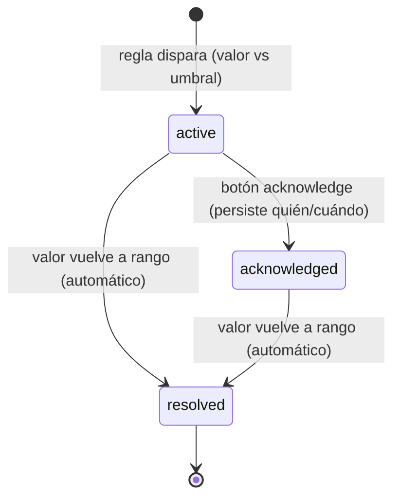

# 06 — Observabilidad (logs, trazas, métricas, alertas, dashboard)

Fuente: plan v1.3.1 F5.5 (puntos 7–20), cambios v1.3.1 #4/#5, §observability y
§dashboard del config. Principio rector: **un solo tracing, un solo módulo de
métricas** (ADR-017) y **toda métrica capturada es visible en alguna pestaña**
(regla de cobertura v1.3, verificada por test de enumeración).

## 1. Taxonomía de registros (quién escribe qué)

| Registro | Fichero | Contenido | Retención | Módulo |
|---|---|---|---|---|
| Log general | stdout/fichero JSON | eventos de aplicación, `correlation_id` por request | operativa | `observability/logging.py` |
| **Audit SOX** | `logs/audit-YYYY-MM-DD.jsonl` | metadatos por acción, **sin contenido de prompts** (`args_hash`) | 48h local → Blob immutable 7 años | `observability/audit_log.py` |
| **Prompt log** | `logs/prompts-YYYY-MM-DD.jsonl` | prompts/completions **ya redactados** | 7 días, purga local, sin archivado | `observability/prompt_log.py` |
| **Trazas LLM** | `logs/traces/{task_id}.json` | árbol de spans por tarea + atributos | operativa; OTLP opt-in | `observability/llm_tracing.py` |
| Alertas | `logs/alerts.jsonl` | entidad Alert con estado | operativa | motor de alertas |
| Métricas | ring buffer (15 min) + serie diaria persistida | contadores rodantes | serie diaria: histórica | `infrastructure/metrics/in_memory.py` |

Separación audit/prompt-log (ADR-011): el audit responde «¿qué hizo el agente?»
para SOX sin exponer contenido; el prompt log responde «¿por qué el plan salió
mal?» para debugging, con retención corta y siempre post-redactor. Se unen por
`correlation_id`.

## 2. Trazas jerárquicas (F5.5.16)

Árbol fijo por tarea: `task → goal_extraction → retrieve → plan → step_1..n →
verify → learn`. Atributos por span: `call_type, model, backend, tokens_in/out,
latency, cache_hit, degraded, prompt_version`; en `retrieve` además `top_k_scores`
y lección elegida; en steps, `tool` y `duration_ms`. Esquema JSON en doc 04 §8.

Emisión: el AgentLoop abre el span raíz; cada caso de uso abre el suyo mediante
context manager provisto por `llm_tracing.py`. Export OTLP
(`llm_traces.export_otlp: true`) hacia Application Insights es opt-in y no
cambia el formato local. **No existe otro módulo de tracing** (v1.3.1 #4
eliminó `tracing.py`; #5 eliminó Prometheus).

## 3. Prompt registry (F5.5.17, ADR-015)

- Los system prompts (Planner, Verifier, GoalExtractor, Interviewer, judge y su
  rúbrica) viven en `prompts/` como ficheros versionados en git.
- `prompt_version` = hash corto del contenido; viaja en telemetría, spans y
  **clave de cache** (cambiar un prompt ⇒ cache miss garantizado, test F5.5-obs).
- Cambiar un prompt = commit + evals en verde, igual que un umbral. Sin esto,
  «funcionaba ayer» es indiagnosticable.

## 4. Métricas continuas de calidad (F5.5.18)

| Serie | Señal que da |
|---|---|
| Distribución semanal de scores de retrieval | shift = drift del corpus o de las queries |
| Tasas path A/B/C en el tiempo | subida de C = faltan lecciones; subida de A con verifier ok-rate bajando = umbral degradado |
| Verifier ok-rate por lección | lección podrida o mundo cambiado |
| Disagreement rules-vs-judge (acceptance híbrido) | judge o reglas desalineados |
| Goals entrantes sin cobertura en golden set | drift de queries → añadir casos/lecciones |
| Latencia p50/p95 por alias | comparación de backends (`--perf` y producción) |

Implementación: ring buffer de 15 min para el WS + serie diaria persistida para
histórico y alertas.

## 5. Motor de alertas (F5.5.19)

Reglas simples evaluadas sobre la serie diaria (claves en
`observability.alerts`): `verifier_ok_rate_min: 0.80`, `c_rate_spike_pct: 30`,
`budget_burn_max_pct_per_hour: 25` (v1.3.1 #7), `escalations_open_max: 10`,
`guardrail_veto_spike_pct: 50`.

Doble canal (v1.3): (a) webhook/email vía `escalations.notify` — para cuando
nadie mira la web; (b) entidad `Alert` persistida en `logs/alerts.jsonl`,
publicada por WebSocket (<1s, badge en pestaña). Máquina de estados:

Sin stack de alerting externo: a escala de equipo, webhook + pestaña bastan
(ADR-014).

## 6. Dashboard (misma app FastAPI, `/dashboard`, HTMX + Tailwind + Chart.js + WS)

| Pestaña | Widgets (mapeo de `dashboard.metrics`) |
|---|---|
| **Overview** | tokens/min, coste €/día, retries_avg, verifier_ok_rate, active_tasks, tasks_awaiting_resume, **último eval report + delta**, **banner de alertas activas** |
| **Alertas** | alerts_active + alerts_history: regla, observado vs umbral, ts, estado, botón acknowledge; push WS <1s |
| **Lecciones** | total, pending_review, lesson_top_reuse / lesson_bottom_reuse, aprobar/rechazar (**/review**) |
| **Escalations** | cola por estado, claim/resolve/dismiss, promote_to_lesson |
| **Cost** | cache_hit_ratio_by_call_type, mini vs full, degradation_rate, presupuesto restante |
| **Calidad** | retrieval_score_distribution, path_rates_over_time, verifier_ok_rate_by_lesson, judge_rules_disagreement, uncovered_goals, latency_p50_p95_by_alias |
| **Guardrails** | guardrail_veto_counts por regla, últimas 50 denegaciones, health por guard |
| **Compliance** | compliance_status: región, auth_mode, backend LLM, content_filter, redactor, archivado, próxima purga — checks N/A **visibles** con backend local |

Reglas: `auth_required: true` (401 sin key); la primera iteración (F4.5) monta
solo Escalations+Review de **esta misma app** (v1.3.1 #6); **test de cobertura
total**: enumeración programática de `dashboard.metrics` vs widgets renderizados
— cualquier métrica sin widget rompe el test.

## 7. Rotación y purga

`scripts/rotate_audit_logs.py` (cron/Task Scheduler diario 04:00): audit >48h →
archiva a Blob (Managed Identity, immutable, `retention_days: 2555`) y borra
local; **si el archivado falla, no borra (exit 2)**. Prompt log: purga a los
`max_age_days` sin archivado. Trazas y alerts: retención operativa (limpieza
manual o `max_age_days` propio si crece).

## 8. Puntos de emisión (dónde se instrumenta)

| Evento | Emisor | Registros que alimenta |
|---|---|---|
| request in/out | middleware FastAPI | audit, log general, métricas |
| llm_call | decorador `@cost_tracked` sobre `LLMPort.complete` | audit, prompt log, span, CostLedger, métricas |
| tool_call | hook del Executor | audit, span step_n, métricas |
| verdict | Verifier | audit, span verify, series de calidad |
| escalation | EscalationQueue | audit, métricas, notify |
| veto de guardrail | GuardrailPort wrapper | audit, pestaña Guardrails |
| checkpoint/resume | task_state repo | log general, tasks_awaiting_resume |

`@cost_tracked` registra `input_tokens, output_tokens, model, backend,
call_type, cost_estimate, cached`; con backend local el coste €=0 pero los
tokens cuentan igual (presupuesto y compactor aplican a ambos backends).
